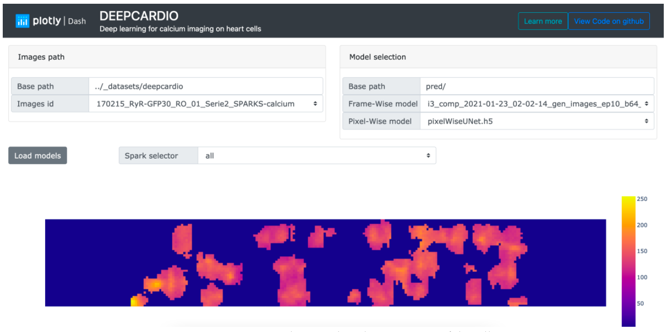
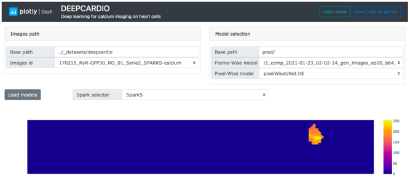
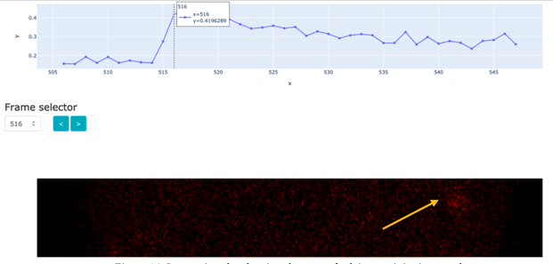

# Deepcardio dash app
#### By Aleix Sacrest Gascon

The application has been developed using the framework dash from plotly. The main idea is to encapsulate both frame-wise 
and pixel-wise classifiers so that they can be used as a single system for classifying and segmenting sparks. The target 
public of the application are experts in the field of cardiac physiology and biomedicine. The application allows to load 
a dataset of images for the classification and perform an in-depth analysis afterwards.  
Figure 1 shows the layout of the dash app. The area (1) highlighted in yellow, allows to select the dataset to be analyzed. 
In the area (2) highlighted in green, there is the option to select the specific models frame-wise and pixel-wise (previously 
trained), this might be useful if one has multiple trained objects. Here it is expected a file of the format h5 containing 
the weight configuration for the neural networks (InceptionV3 and UNet). Finally, the button (3) highlighted in orange 
loads the selected models in (2) and starts the classification (frame-wise) and segmentation (pixel-wise) of the selected 
dataset in (1).  

  
**Figure 1** - Deepcardio dash app usage 1

Once the classification is done, it will appear a heatmap showing the hotspots in terms of calcium activity in the cell. 
The regions where the heatmap takes higher values is where the sparks have appeared throughout the sequence. Note that 
multiple sparks can appear in the same region. There is an example in Figure 2. The dropdown selector “Spark selector” 
allows to select a specific spark for visualizing individually its calcium activity. There is an example of the heatmap 
for a single spark in Figure 3.

  
**Figure 2** - Deepcardio dash app usage 2

  
**Figure 3** - Deepcardio dash app usage 3

When a single spark is selected, it is also plotted its trace. The trace shows frame by frame the average intensity of 
the calcium in the affected region by the spark. The trace is visualized directly under the heatmap plot in the dash app 
application. This is an interactive plot and when the plot is hovered, the corresponding frame is displayed live in a 
picture below, as it is shown in Figure 4. It is also possible to navigate the frames with the blue arrows of the “Frame selector”.

  
**Figure 4** - Deepcardio dash app usage 4
